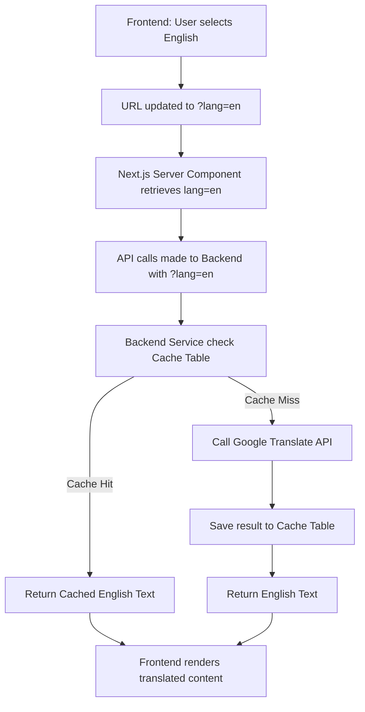

# Design Spec: Auto-Translation Feature (Indonesian <-> English)

This document details the architecture and implementation plan for adding translation capability to the portfolio website. It supports translating static UI strings (frontend dictionary) and dynamic database-driven data (automatically translated using a backend translation service with database caching).

---

## 🛠️ Architecture Overview

The system consists of:
1. **Frontend Local Dictionary (`translations.ts`)**: For static UI labels such as buttons, section headers, and form titles.
2. **Next.js Server Component Routing**: Reads the `lang` search parameter from the URL (`?lang=en` or `?lang=id`) and passes it to API calls.
3. **Backend translation_cache Database Table**: Stores previously translated text to avoid duplicate API requests, prevent rate limiting, and guarantee instant responses.
4. **Backend Translation Service**: Resolves translation requests. Uses direct `fetch` to Google Translate's free extension API (`client=gtx`).



---

## 💾 Database Schema (`translation_cache` Entity)

A new table `translation_cache` is added to store cached translations:

| Field | Type | Description |
|---|---|---|
| **id** | Integer (Primary Key, Auto Increment) | Unique ID |
| **sourceText** | Text (Indexed) | Original text (mostly Indonesian) |
| **targetLang** | String (length 5) | Language code (e.g., 'en') |
| **translatedText** | Text | The translated value |

---

## 🔧 Backend Implementation

### 1. `TranslationCache` Entity (`backend/src/modules/translation/translation-cache.entity.ts`)
Creates the TypeORM entity for SQLite.

### 2. `TranslationService` (`backend/src/modules/translation/translation.service.ts`)
- `translate(text: string, targetLang: string): Promise<string>`
  - If text is empty or falsy, return empty string.
  - Query DB cache for exact `sourceText` and `targetLang`.
  - If found, return cached text.
  - If not found, fetch from:
    `https://translate.googleapis.com/translate_a/single?client=gtx&sl=auto&tl=${targetLang}&dt=t&q=${encodeURIComponent(text)}`
  - Parse the array response:
    - Google's response is structured as `[[[translated, source, ...]], ...]`
    - Extract and join translated chunks.
  - Store the translated result in the database cache.
  - Return the translation. If any error occurs, log it and return the original text.

### 3. Controller & Service updates
Update backend modules to translate dynamic content if `lang === 'en'`:
- **Profile**: `name`, `title`, `bio`, `aboutMe`.
- **Project**: `title`, `description`.
- **Academic**: `institution`, `degree`, `field`, `description`.
- **Experience**: `position`, `company`, `location`, `description`.
- **Blog**: `title`, `excerpt`, `content`.
- **Award**: `title`, `description`.

---

## 🖥️ Frontend Implementation

### 1. Static Dictionary (`frontend/src/lib/translations.ts`)
Contains keys for all static texts in the UI.

### 2. API Utility (`frontend/src/lib/api.ts`)
Update all `api` routes to accept `lang` parameter and append it to the fetch URL:
```typescript
export const api = {
  getProfile: (lang?: string) => fetcher<Profile>(`/profile?lang=${lang || 'id'}`),
  // ...
};
```

### 3. Home Page (`frontend/src/app/page.tsx`)
- Read `searchParams` from Server Component props:
  ```typescript
  export default async function Home({ searchParams }: { searchParams: Promise<{ lang?: string }> }) {
    const { lang = "id" } = await searchParams;
    // ... fetch APIs passing lang ...
  }
  ```
- Use localized labels from `translations[lang]` for static text.

### 4. Navbar Language Toggle Component (`frontend/src/components/Navbar.tsx`)
- Add a client-side state for language.
- Provide a visually premium toggle button: `ID | EN` in the navbar with hover effects, transitions, and a glow indicator matching the current portfolio aesthetics.
- Store selected language in `localStorage`.
- Sync the URL parameter on click: `router.push('/?lang=en')` (or update via standard window navigation / search parameters update).

---

## 🧪 Verification Plan

1. **Unit Test API Connection**: Verify translation endpoint returns correct English translation for sample Indonesian strings.
2. **Check Database Caching**: Run translation twice on the same text and verify the second request resolves instantly without calling Google API (can verify by watching database inserts/logs).
3. **Verify Frontend UI Integration**:
   - Verify clicking `EN` toggles all UI text and dynamic text to English.
   - Verify clicking `ID` switches back to Indonesian.
   - Verify page reload preserves language selection (checked via `localStorage` and query param).
