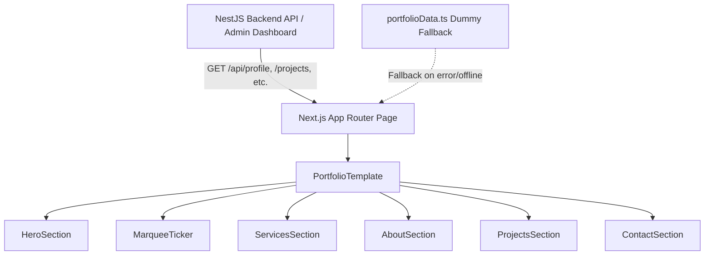

# Figma Portfolio V2 Rework — Design Specification

- **Author**: Eriko Syah Putra / Antigravity
- **Date**: 2026-09-25
- **Branch**: `rework/figma-portfolio-v2`
- **Status**: Approved (Drafting Spec)

---

## 1. Overview & Objectives

Rework the personal portfolio frontend based on the modern Figma UI/UX reference designs (Oliver Scott / Jenny Scott style). The new design features an editorial, high-contrast, playful yet professional aesthetic tailored for **Eriko Syah Putra** as a **Full-Stack Engineer & Web Developer**.

### Key Goals
1. **Design System & Aesthetics**:
   - Modern warm cream canvas (`#FDFBF7`) with subtle 1px blueprint grid lines.
   - High-contrast Vibrant Coral / Sunset Red (`#FF462E`) accent and dark charcoal (`#0F0F11`) surfaces.
   - Chamfered / notched accordion cards and distinct geometric backdrops.
   - Fluid typography with editorial badges, social proof ratings, and floating skill pills.
2. **Component Architecture**:
   - Built following **Atomic Design** principles (`atoms`, `molecules`, `organisms`, `templates`).
   - Styled with **Tailwind CSS** for maintainable, utility-first styling.
   - Enhanced with **Iconsax** (`iconsax-react` / modern geometric SVGs) and **Framer Motion** for micro-interactions (spinning circular badges, floating pills, smooth accordion transitions).
3. **Admin & Data Synchronization**:
   - Fully integrated with the existing NestJS backend API (`/api/profile`, `/api/projects`, `/api/experiences`, etc.).
   - Dynamically reflects updates made via the existing `/admin` dashboard.
   - Includes structured, realistic dummy fallback data (`portfolioData.ts`) so the site renders flawlessly even in offline/mock mode.

---

## 2. Visual & Design Tokens

### Color Palette
- **Backgrounds**:
  - `canvas-cream`: `#FDFBF7`
  - `canvas-surface`: `#FFFFFF`
  - `canvas-dark`: `#0F0F11` / `#16161A`
  - `canvas-card-hover`: `#1C1C22`
- **Accents (Sunset Coral)**:
  - `coral-primary`: `#FF462E`
  - `coral-hover`: `#E63B24`
  - `coral-light`: `#FFF1EE`
  - `coral-ring`: `rgba(255, 70, 46, 0.2)`
- **Typography & Neutral**:
  - `charcoal-text`: `#121214`
  - `charcoal-muted`: `#666672`
  - `border-subtle`: `#ECE8DF` / `rgba(0,0,0,0.06)`
  - `grid-line`: `rgba(0, 0, 0, 0.04)`

### Typography & Grid
- Headings: Bold, geometric sans-serif (Inter / Plus Jakarta Sans) with accent highlights in coral.
- Grid: CSS background grid pattern (`120px` or `80px` repeating linear gradients) on warm cream canvas.

---

## 3. Atomic Design Hierarchy

### `atoms/`
- **`Button.tsx`**: Pill CTA button supporting primary coral, dark, and outline styles with optional trailing arrow icon.
- **`Badge.tsx`**: Rounded floating skill pill tags (`Full-Stack`, `Next.js`, `NestJS`, `System Architecture`).
- **`SpinningBadge.tsx`**: Continuously rotating circular text stamp (`HIRE ME ✦ HIRE ME ✦`) with a center arrow or icon.
- **`SectionHeader.tsx`**: Pre-title badge label (e.g. `— My Specialization`) and headline with highlighted keywords.
- **`IconWrapper.tsx`**: Consistent container for Iconsax glyphs with custom sizing and variant styling.

### `molecules/`
- **`RatingBadge.tsx`**: Social proof badge with stacked client avatars, 5-star rating, and count (`150+ Reviews (4.9 of 5)`).
- **`QuoteCard.tsx`**: Floating client testimonial card featuring quote mark accents and glowing border.
- **`SocialMediaGroup.tsx`**: Horizontal row of rounded icon buttons for GitHub, LinkedIn, X, and Email.
- **`ServiceAccordionItem.tsx`**: Numbered accordion row (`01`, `02`) with title, toggle arrow, sub-tags, description, and preview image.
- **`NavLinks.tsx`**: Clean desktop and mobile navigation links with active state indicator.

### `organisms/`
- **`Navbar.tsx`**: Floating pill or sticky header with personal brand logo, navigation links, and "Contact Me" CTA.
- **`HeroSection.tsx`**:
  - Center: Photo of Eriko Syah Putra with coral arch backdrop.
  - Floating Left: Rating review badge & client avatar stack.
  - Floating Right: Testimonial quote card & skill badges (`Prototype`, `Dashboard`, `Full-Stack`, `API`).
  - Bottom: Dual CTAs ("Portfolio ->" and "Hire Me") and social media links.
- **`MarqueeTicker.tsx`**: Seamless full-width dark ticker banner (`Website Design ✦ Full-Stack Development ✦ API Architecture ✦ Dashboard UI ✦`).
- **`ServicesSection.tsx`**: Interactive accordion displaying key technical services with media and tag previews.
- **`AboutSection.tsx`**: Dark contrast section showcasing profile cutout, bio, stats, "Download CV" CTA, and signature.
- **`ProjectsSection.tsx`**: Grid of featured projects with category filters, live links, and GitHub repositories.
- **`ContactSection.tsx`**: Editorial contact form and footer links.

### `templates/`
- **`PortfolioTemplate.tsx`**: Assembles the entire homepage layout, grid background, and global micro-interactions.

---

## 4. Data Flow & Admin Compatibility

- When the backend is running, real data saved from the `/admin` dashboard (profile details, projects, experiences) is consumed dynamically.
- If data is missing or empty, default dummy values tailored for **Eriko Syah Putra** are used as graceful fallbacks.
- Existing routes (`/admin`, `/blog`, `/projects/[id]`) remain intact and functional.

---

## 5. Verification & Quality Gate
1. **Compilation**: `npm run build` in `frontend` passes with zero TypeScript and lint errors.
2. **Visual Fidelity**: Accurate reproduction of Figma elements (warm cream grid, floating pills, rotating badge, dark accordion).
3. **Responsive Design**: Flawless layout on desktop, tablet, and mobile screens.
4. **Admin Verification**: Data modified in `/admin` successfully updates the frontend presentation.
